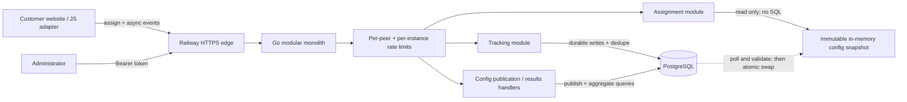
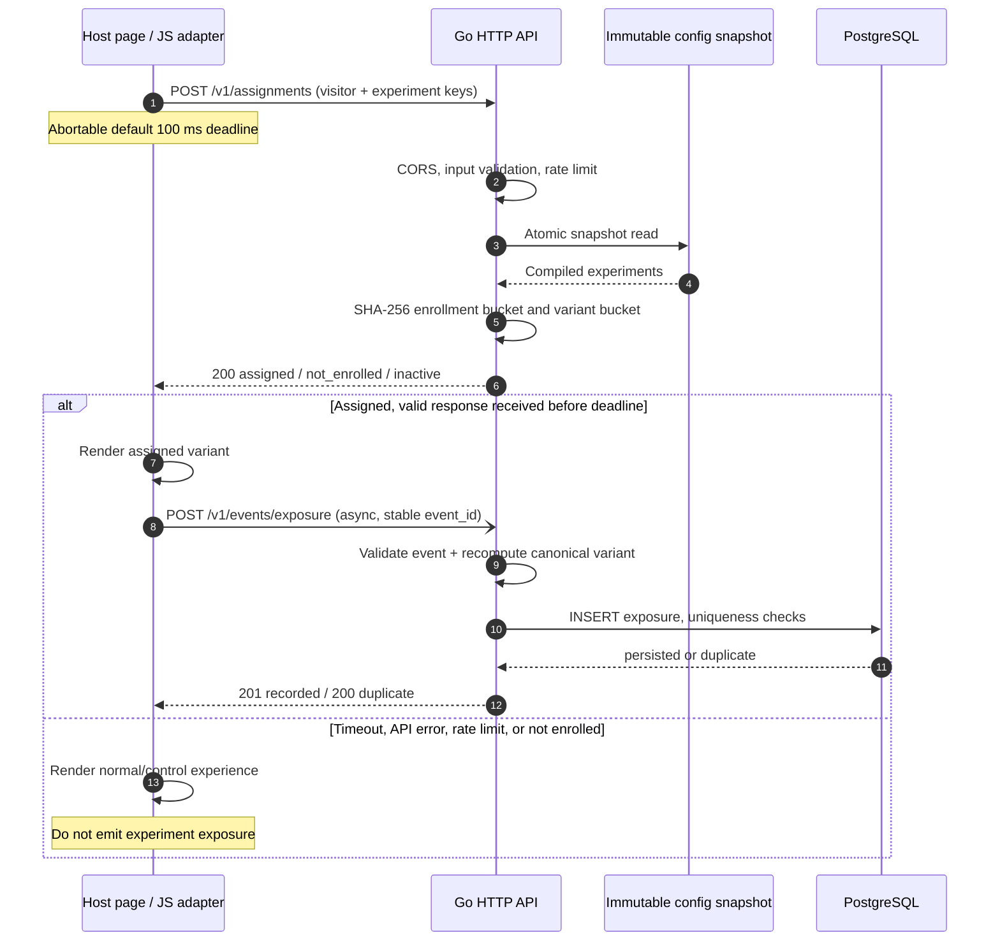
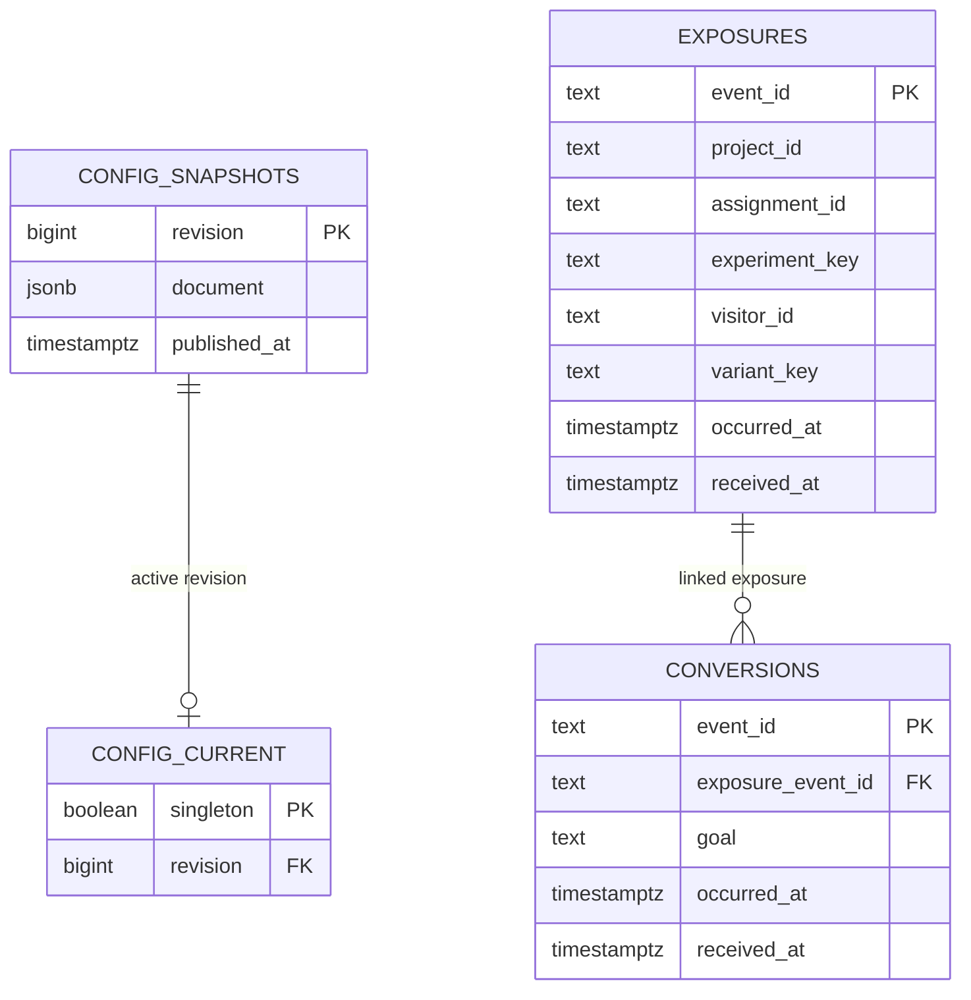

# Architecture Diagrams and Validation Evidence

**Companion to [DESIGN.md](DESIGN.md)** | Experiment Assignment Service | 2026-10-08

This document provides the **HLD**, **LLD request sequences**, **PostgreSQL schema relationships**, and a consolidated **test-evidence matrix**. The main [system design](DESIGN.md) remains the authoritative explanation of alternatives, failure contracts, and scale trade-offs. All diagrams describe the implemented take-home service, not a hypothetical microservices platform.

## 1. High-Level Design (HLD)



**Why this architecture:** assignment is page-render-sensitive, so it reads a prevalidated in-process snapshot and computes two deterministic SHA-256 buckets without database I/O. Event writes and administrative changes need durability and stronger coordination, so they use PostgreSQL. A single Go deployment is sufficient for the take-home; logical modules preserve a path to later separation if scaling demands it. Rate limits are in-memory and *per instance*, not a substitute for edge/tenant quotas.

**Control/data separation:** PostgreSQL stores revisioned configuration and durable events. `config_current` selects the active `config_snapshots` revision. API instances poll for updates and atomically swap compiled snapshots; already-started instances can continue assignments from last-known-good config during a PostgreSQL outage. A newly starting database-required instance fails closed when PostgreSQL is unavailable.

## 2. Low-Level Design (LLD): assignment and exposure sequence



**Stickiness:** a visitor's bucket is derived from length-prefixed `sha256-v1`, purpose (`enrollment` or `variant`), project ID, immutable assignment/cohort ID, and stable visitor ID. A bucket lies in `[0, 9999]`. Enrollment uses `bucket < traffic_bps`; variant selection uses an independent hash against ordered cumulative weight ranges totaling 10,000. There is **no per-visitor assignment row**. The design is statistically distributed over distinct stable IDs, not an exact promise of 50/50 in every finite sample.

**Immutable assignment contract:** a metadata revision change does not alter the hash. Increasing traffic can enroll new visitors while retaining existing assignments. Reducing traffic or changing ordered variant weights requires a new cohort; publishing an incompatible change to an existing cohort is rejected.

**Event ordering:** assignment does not imply exposure. The browser sends exposure only after successful rendering; asynchronous hosts must issue it when actually visible. Transient HTTP 429/502/503/504 and network failures are retried up to three attempts with the identical event ID, timestamp, and payload. Events are still best-effort if the tab closes.

## 3. LLD: conversion, configuration publication, and results

```mermaid
sequenceDiagram
    autonumber
    participant Site as Host page / adapter
    participant API as Go API
    participant Service as Tracking service
    participant PG as PostgreSQL

    Site->>API: POST /v1/events/conversion (event_id, cohort, goal)
    API->>Service: Validate and resolve exposure
    Service->>PG: Lookup canonical exposure by project/cohort/visitor
    alt Exposure exists; timestamp valid
        Service->>PG: INSERT conversion (exposure_event_id, goal)
        Note over PG: Unique event_id and (exposure_event_id, goal)
        PG-->>API: New row or idempotent duplicate
        API-->>Site: 201 recorded or 200 duplicate
    else Exposure absent / event invalid
        API-->>Site: 409 exposure_not_found / 400 invalid_event
        Note over Site: 409 missing exposure needs app-managed retry
    else Database unavailable
        API-->>Site: 503 tracking_unavailable
    end
```

```mermaid
sequenceDiagram
    autonumber
    participant Admin as Authorized administrator
    participant API as Go API
    participant PG as PostgreSQL
    participant Cache as In-memory snapshot

    Admin->>API: POST /v1/admin/config (document + expected_revision)
    API->>PG: BEGIN + lock config_current row
    API->>API: Validate identity/weight/traffic compatibility
    API->>PG: Compare revision; insert config_snapshots; update pointer
    PG-->>API: COMMIT; new revision (or 409 conflict)
    API->>Cache: Refresh authoritative snapshot when available
    API-->>Admin: Publication result
    Note over Cache: Other instances refresh by polling (~2 seconds)
```

**Reporting:** `GET /v1/admin/results` performs goal-specific exposure and conversion aggregates in PostgreSQL, joins results to the canonical published variant list, and returns `conversion_rate = unique converters / unique exposed visitors`. A variant with zero exposures reports `null`, not 0. This is descriptive reporting, **not** a significance test or an automatic winner declaration.

## 4. PostgreSQL relationship model



**Database-enforced invariants:** `exposures` has a unique `(project_id, assignment_id, visitor_id)` key; `conversions` has a unique `(exposure_event_id, goal)` key; and both tables have unique `event_id` primary keys. A conversion references a persisted exposure. A database transaction serializes configuration publishers by locking the singleton active-revision row. Refer to [`migrations/001_init.sql`](../migrations/001_init.sql) for the exact schema.

## 5. Validation: what was actually tested

| Area | Test / evidence | Observed result |
|---|---|---|
| Deterministic assignment | Golden hash vectors; repeated/cross-instance IDs; independent buckets | Go tests passed |
| Allocation distribution | 50/50, 90/10, three variants; 25% enrollment | Go tests passed; statistical expectation, not exact count |
| Sticky updates | Revision changes and monotonic traffic ramp; reject weight/traffic reduction | Go tests passed |
| Atomic configuration | Concurrent snapshot readers, incompatible publish, revision conflicts | Unit tests passed; real PG integration also passed |
| PostgreSQL integration | `TestIntegrationConfigPublishingAndEventCounting` with `TEST_DATABASE_URL` | Passed against isolated PostgreSQL 16, including in full Go suite |
| Tracking correctness | Duplicate event IDs, visitor/cohort dedup, conversion ordering, concurrent exposure | Go tests passed |
| Browser resilience | 503 retry same ID/payload, 429 `Retry-After`, bounded network retries, control fallback | 6/6 Node tests passed |
| Rate limits and validation | 429 + `Retry-After`, spoofed forwarded headers, shared tracking budget, bounded client map | Go tests passed |
| Race/static analysis | `go test -race -tags pgx ./...`; `go vet -tags pgx ./...` | Passed in developer environment |
| DB outage/recovery | Stop PostgreSQL; request assignment; retry tracking after restore | Assignment 200; tracking 503; retry 201; replay 200 duplicate |
| Concurrent same-visitor events | 20 distinct event IDs for the same exposure identity | 1 created, 19 duplicates, zero request failures |
| Railway public smoke test | HTTPS health, readiness, unauthenticated admin, two assignments, exposure, duplicate, conversion, authenticated results | 200, 200, 401, 200, 201, 200, 201, with SQL-backed results |

**Local assignment performance** (30 seconds each, two experiment decisions per request, **measured before the most recent rate-limit/browser updates**):

| Target RPS | Completed | Achieved RPS | p50 | p95 | p99 | Failures |
|---:|---:|---:|---:|---:|---:|---:|
| 100 | 3,000 | 100.0 | 1.17 ms | 1.69 ms | 2.45 ms | 0 |
| 500 | 14,987 | 499.5 | 0.93 ms | 1.42 ms | 2.27 ms | 0 |
| 1,000 | 29,993 | 999.7 | 0.63 ms | 0.99 ms | 1.56 ms | 0 |

**Total:** 47,980 successful local assignment calls and no observed failures. These are single-machine/local-container figures, **not** evidence of production throughput or tail latency. Load tests were not rerun after the later hardening changes.

**Hosted SQL-backed test:** One synthetic treatment exposure and one conversion were recorded on Railway; the repeated exposure was deduplicated, and authenticated results showed treatment 1/1 and control 0/0 (`null` rate). This validates workflow wiring, **not** treatment effectiveness or statistical significance.

## 6. Failure cases and honest boundaries

| Dependency / failure | Behavior | Known limitation |
|---|---|---|
| Assignment API slow, 429, or down | JS deadline/failed request => render normal control immediately | Fail-safe behavior depends on host site using the adapter properly |
| PostgreSQL down after startup | Warm config allows read-only assignment; writes return 503 | Snapshot may become stale; emergency pause not guaranteed |
| PostgreSQL unavailable on cold start | Database-required API refuses startup | No independent persistent edge snapshot |
| Duplicate event / transient error | Semantic uniqueness plus stable ID supports safe retry | Browser delivery isn't guaranteed if session ends |
| Conversion arrives first | 409 exposure_not_found | Application must retry after successful exposure |
| Analytics/statistics | Goal-scoped descriptive conversion rates | No SRM alarm, confidence interval, p-value or sequential testing |
| Millions of assignments | Horizontal replicas serve stateless in-memory reads | Hosted capacity at this scale not yet benchmarked |
| High event volume | PostgreSQL write and index costs increase | No broker, partitioned retention, or aggregated warehouse yet |
| Multi-replica / edge | Replica-local caches and rate buckets | No shared global rate limit or guaranteed kill-switch SLA |

**Next increments when justified:** edge tenant quotas, bounded config freshness/kill switch, privacy retention, durable ingestion queue and aggregates, and statistically appropriate experiments. Adaptive traffic policies (e.g. contextual/bandit allocation) require logging assignment propensities and preserving visitor stickiness; cross-site learning requires privacy controls and checks against transferring biased results across incomparable populations. These were intentionally **not** implemented for the take-home.
