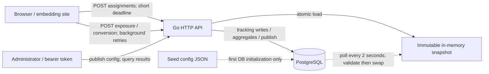

# Experiment Assignment Service — System Design

**Scope:** lightweight, multi-tenant A/B experimentation backend | **Review date:** 2026-10-08
**Implementation:** Go modular monolith, in-process immutable configuration snapshots, PostgreSQL, minimal browser adapter
**Status:** implemented, locally validated (including PostgreSQL integration), and publicly deployed at [https://api-production-1d91.up.railway.app](https://api-production-1d91.up.railway.app). Production HTTPS smoke tests passed on 2026-10-08. **This is not a production security certification.**

## 1. Problem and design position

On a customer's page-render path, the service must answer **which variant should this visitor see?** quickly and consistently. The same system must accept configuration changes, record only genuine *reported* exposures/conversions durably, and return interpretable experiment counts without implying statistical certainty.

The chosen architecture intentionally separates the concerns by **runtime data dependency**, not by prematurely splitting into microservices:

- **Serving plane:** synchronous, deterministic, read-only assignment from a validated local snapshot; never needs a PostgreSQL call on the warm request path.
- **Control plane:** authenticated publication of a complete, revisioned configuration; PostgreSQL is authoritative, and serving replicas converge by polling.
- **Event plane:** validated exposure/conversion endpoints; writes require successful PostgreSQL persistence before acknowledging success.
- **Reporting plane:** authenticated, SQL-based descriptive results scoped to immutable experiment cohorts and conversion goals.

The exercise supports multiple projects, concurrent experiments, multivariant allocations, traffic holdbacks, safe publication, idempotent tracking, and results. Targeting rules, automated experiment winners, cross-device identity, a dashboard, Redis/Kafka, multi-region replication, and full tenant RBAC are deliberately out of scope.

## 2. High-level architecture

**Deployment unit:** one Go process with distinct `assignment`, `config`, `tracking`, `storage`, and `httpapi` packages. It keeps deployment and local debugging simple. Logical separation does **not** eliminate shared CPU, Go scheduler, process, or connection-pool failure modes.

**Persistence model:** the initial JSON document seeds an empty database. Once published, the latest PostgreSQL snapshot wins on restart; file content must not silently overwrite it. A database-backed process cannot cold-start without connecting to PostgreSQL. `REQUIRE_DATABASE=true` prevents accidental assignment-only startup in the Compose deployment.

## 3. Assignment contract: stable by construction

A logical experiment cohort is defined by `(project_id, experiment_key, assignment_id)`. Stable assignment depends on stable `visitor_id`, immutable variant definitions, and a stable algorithm, rather than on a stored row per visitor.

**Algorithm `sha256-v1`:**

1. Encode each of `algorithm`, `purpose`, `project_id`, `assignment_id`, and `visitor_id` as a four-byte big-endian length followed by UTF-8 bytes.
2. Hash the concatenation with SHA-256; interpret the first eight digest bytes as an unsigned big-endian integer, then take modulo **10,000**.
3. For `purpose=enrollment`, include the visitor if `bucket < traffic_bps`.
4. For included visitors, independently hash with `purpose=variant`, and select from ordered cumulative variant ranges. Positive integer `weight_bps` values must sum exactly to **10,000**.

Two purpose-separated hashes ensure enrollment and variant selection are not coupled. Integer ranges avoid floating-point boundary errors. The same visitor/cohort produces the same decision across process restarts and replicas, subject to the same immutable configuration and hashing version. Population distributions converge statistically; they are not guaranteed exact for a small sample.

### Configuration changes without rebucketing

| Change | Behavior | Reason |
|---|---|---|
| Increase `revision` without assignment-relevant changes | Allowed | `revision` is deliberately not hashed |
| Increase `traffic_bps` | Allowed with revision | Previously enrolled visitors stay enrolled and keep their variant |
| Reduce `traffic_bps` | Rejected | Could exclude previously enrolled visitors |
| Pause/resume cohort | Allowed with revision | Pause returns `inactive`; it does not silently assign a new variant |
| Change variant key, order, or weight | Rejected in an existing cohort | Could reassign established visitors |
| Change allocation from 50/50 to 90/10 | Publish a new experiment key/cohort | Keeps original cohort analytically separate |

The service recognizes `assigned`, `not_enrolled`, `inactive`, and `unknown_experiment`; an unknown project is a 404. `assignment_id` represents the immutable cohort; the administrative revision is separate. Assignment itself **is not an exposure**.

**Limit:** stable hashes do not prove that a human visited, that an ID belongs to a real user, or that a displayed variant was genuinely observed.

## 4. Configuration publication and cache convergence

The admin API accepts the **complete** configuration plus `expected_revision`.

1. Begin a PostgreSQL transaction; lock the singleton `config_current` row (`SELECT ... FOR UPDATE`).
2. Check the expected global revision and validate proposed content against the last published snapshot, including immutable cohorts and monotonic traffic rules.
3. Insert an append-only `config_snapshots` JSONB document with its new revision.
4. Update the `config_current` pointer inside the same transaction and commit before returning success.
5. Each API replica periodically loads the authoritative document, compiles and validates it, then atomically swaps its immutable local snapshot.

A revision mismatch returns **409**, and invalid proposed configuration returns **400**. Readers never observe partially compiled ranges. During database unavailability, already-started replicas continue assigning from the **last-known-good** snapshot.

**Consistency trade-off:** a pause/ramp-up is eventually consistent between replicas (normally refreshed within the two-second polling cadence when PostgreSQL is healthy). During a storage outage, previously loaded configuration can remain stale indefinitely. This is acceptable for the take-home, **not** a strong emergency kill switch. A real kill-switch SLA requires separate invalidation or a bounded staleness policy. The global JSONB document and singleton publication lock also become a contention point for thousands of independently managed tenants.

## 5. Events, attribution, and idempotency

### Data schema

- `config_snapshots(revision PK, document JSONB, published_at)` — immutable published history.
- `config_current(singleton PK, revision FK)` — active global pointer.
- `exposures(event_id PK, project_id, assignment_id, experiment_key, visitor_id, variant_key, occurred_at, received_at)` with **UNIQUE `(project_id, assignment_id, visitor_id)`**.
- `conversions(event_id PK, exposure_event_id FK, goal, occurred_at, received_at)` with **UNIQUE `(exposure_event_id, goal)`**.

Assignments need no per-visitor assignment table. PostgreSQL unique constraints—not an in-process mutex—enforce idempotency even across concurrent requests/instances.

### Exposure lifecycle

1. Browser requests an assignment with an opaque, stable visitor ID.
2. Host page synchronously renders the chosen variant; only then does the adapter asynchronously dispatch an exposure event. An asynchronous renderer must dispatch at its **actual visibility callback**, not when a render request starts.
3. Server validates identifiers and client timestamp, resolves the cohort, and recomputes the expected variant; it does not simply trust the posted variant.
4. `INSERT ... ON CONFLICT DO NOTHING` plus read-back distinguishes a new persisted exposure, an idempotent duplicate, and contradictory reuse of an event ID.

The first accepted exposure per visitor/cohort is the denominator. A repeated pageview does not add another exposure. A fabricated visitor ID can still produce an apparently valid event: variant verification is a correctness check, **not authentication**.

### Conversion lifecycle

A conversion refers to a previously persisted exposure in the same cohort/visitor identity. The API looks up that exposure and attributes the conversion to its canonical variant. For each goal, a visitor can contribute at most one conversion. Conversions timestamped before the linked exposure are rejected. Client `occurred_at` values must be within roughly **7 days past / 5 minutes future**, which is a validation boundary rather than a business attribution-window model.

**HTTP outcomes:**

| Case | Response |
|---|---|
| New event persisted | `201 {"status":"recorded"}` |
| Idempotent duplicate | `200 {"status":"duplicate"}` |
| Invalid fields or timestamp | `400 invalid_event` or `400 invalid_request` |
| Assignment variant mismatch / conflicting event ID | `409 assignment_mismatch` / `409 event_conflict` |
| Conversion before its exposure is saved | `409 exposure_not_found` |
| PostgreSQL write unavailable | `503 tracking_unavailable` |
| API request exceeds rate limit | `429 rate_limited` plus `Retry-After: 1` |

A database outage must **never** result in a `2xx` claim of durable tracking success. Browser-to-server **exactly-once delivery is not claimed**: browser closure, consent rules, transient/offline failures, and event ordering can still lose observations.

## 6. Browser adapter and page-render safety

`examples/browser-integration.js` is intentionally minimal:

- Assignment uses an abortable **100 ms default deadline**; a failed, timed-out, rate-limited, or inactive assignment renders the site's normal/control experience and does not send an experiment exposure.
- Late assignments are ignored to avoid changing the rendered experience after the deadline.
- Following successful **synchronous** rendering, exposure tracking is dispatched without awaiting it on the page-render critical path.
- Tracking retries transient network/timeout failures and HTTP **429, 502, 503, 504**, up to **three attempts**, preserving the **same serialized JSON**, including `event_id` and `occurred_at`.
- `Retry-After` is recognized for 429; retry delays are bounded. Permanent 4xx responses are not retried automatically.
- `recordConversion(...)` returns the final response; callers must check `.ok`. A 409 `exposure_not_found` requires an application-managed retry after exposure persistence, reusing the original event ID.

The default adapter does **not** persist a client event queue. Custom `onExposure` callbacks own their delivery/retry strategy. Consent, stable visitor identifiers, and renderer visibility are responsibilities of the integrating site.

## 7. Results and meaning of a conversion rate

`GET /v1/admin/results` uses separate SQL aggregates by variant for exposures and conversions for **one goal and one immutable cohort**, then merges the results with the canonical variant list. This avoids accidental multiplication of counts from naive raw event joins.

`conversion_rate = unique_converters_for_goal / unique_exposed_visitors`.

A zero-exposure variant is present with `conversion_rate: null`, **not zero**. Reported values are descriptive; there is no automated winner, p-value, confidence interval, or uplift significance claim. A later analytics product must define sample-ratio mismatch (SRM) checks, minimum detectable effects/power, multiple testing, sequential decisions, bot/consent filtering, and exposure-triggering bias. Counting only people whose variant visibly rendered can create selection bias relative to an intent-to-treat population.

## 8. Security model and deliberate boundaries

- **Admin endpoints:** a server-side bearer token (`ADMIN_TOKEN`, at least 16 characters in DB mode); SHA-256 digest compared with `crypto/subtle.ConstantTimeCompare`. Admin routes reject browser `Origin` headers. Production requires HTTPS, strong rotated credentials, and eventually RBAC/audit actors.
- **Public site key:** `public_key` identifies the tenant/project; it is **not a credential**. CORS allowlisting reduces unwanted browser origin access, but cannot authenticate scripts/non-browser callers.
- **Input and SQL:** 64 KiB HTTP JSON cap, rejection of unknown/trailing fields, bounded identifiers, parameterized SQL, request/DB timeouts, and response security headers. Character-set/UUID validation could be stricter.
- **Rate limiting:** in-process token buckets by TCP peer with a separate global per-instance ceiling (10× corresponding peer rate/burst); assignment default **1,500/s burst 3,000**, tracking exposure+conversion **60/s burst 120**, admin **10/s burst 20**. Limits are adjustable via environment variables. Overruns return HTTP 429 and `Retry-After: 1`.
- **Proxy/rate-limit limitations:** the application deliberately ignores untrusted `X-Forwarded-For`; behind a load balancer all users may share the proxy's peer bucket. Per-instance limits reset on restart and are not coordinated across replicas. Hosting-edge limits, project-specific quotas, and abuse monitoring remain necessary.
- **Event integrity:** visitors control IDs and event timestamps; signed assignment receipts and bot controls are future mitigations, not implemented guarantees.
- **Data protection:** opaque visitor IDs are stored. No automated deletion, project purge, consent workflow, or retention enforcement exists. Set privacy policy and retention limits before real customer traffic.
- **Deployment:** `REQUIRE_DATABASE=true` in Compose, non-root container, `.dockerignore` excludes secrets, supported Go/Alpine base images. Local Compose PostgreSQL uses `sslmode=disable` *only on the internal Docker network*; a remote managed database should require TLS. Rotate development secrets before external deployment.

## 9. Reliability and fail-safe behavior

| Failure mode | Actual behavior / trade-off |
|---|---|
| API unavailable or slow at page render | SDK deadline then control; host page not blocked by tracking |
| DB unavailable after service starts | Warm assignments continue from last snapshot, even if stale |
| DB unavailable on cold startup | DB-backed process fails to start |
| Failed / competing config publish | Old published revision preserved; invalid/stale request rejected |
| DB fails during event write | HTTP 503; a client may retry with same event ID after recovery |
| Duplicate / concurrent events | Database constraints ensure one semantic exposure and one goal conversion per visitor |
| Conversion before saved exposure | 409; client must retry after exposure commits |
| Assignment ready but tracking unavailable | `/readyz` still returns 200 **by design**: it reflects assignment-snapshot readiness, not full-service write readiness |
| Config pause during database outage | Last-known-good serving may continue; emergency stop not guaranteed |
| Proxy or malicious event traffic | Local bucket limits provide bounded protection; distributed edge controls still needed |

No persistent queue or replay facility is built into the service. A production operational contract should distinguish **assignment availability** from **tracking ingestion availability**, publish separate metrics/alerts, and set staleness/kill-switch expectations.

## 10. Measured evidence and validation

### Local assignment load test (before final hardening changes)

The supplied Go load generator sent requests to the locally running Docker API, with **two experiments per assignment request**. These measurements were obtained during the earlier implementation phase, before the newest rate-limiter/browser-retry update; they have **not** been rerun against a public deployment.

| Planned RPS | Duration | Completed / failures | Achieved RPS | p50 | p95 | p99 | Maximum |
|---:|---:|---:|---:|---:|---:|---:|---:|
| 100 | 30 s | 3,000 / 0 | 100.0 | 1.17 ms | 1.69 ms | 2.45 ms | 14.53 ms |
| 500 | 30 s | 14,987 / 0 | 499.5 | 0.93 ms | 1.42 ms | 2.27 ms | 26.13 ms |
| 1,000 | 30 s | 29,993 / 0 | 999.7 | 0.63 ms | 0.99 ms | 1.56 ms | 7.46 ms |

**Total:** 47,980 successful local requests; zero reported request failures/drops. Results describe a single local client/server environment with a warmed assignment path. They do **not** establish production availability, cross-region latency, statistically representative tail performance, or 100k RPS capacity. Differences in latency between rates should not be interpreted as performance improving with load.

### Correctness and failure tests

- Go assignment tests pass for cross-instance determinism, bucket golden vectors, 50/50 and 90/10 distributions, multivariant selection, enrollment, ramp-up, validation, and no rebucketing on revision changes.
- Configuration tests pass for compatibility/immutability, atomic publication and concurrent readers.
- Tracking/HTTP tests pass for event-id deduplication, semantic deduplication, out-of-order conversions, and concurrent requests.
- A **real PostgreSQL 16 integration test** (`TestIntegrationConfigPublishingAndEventCounting`) was run and passed on the developer's dedicated local test database; it also passed as part of a full `-tags pgx` suite. It covers publication/revision conflicts, persisted events/conversions, results, and an invalid allocation update.
- The full Go suite, race detector, and `go vet` passed locally. The six Node browser tests and rate-limiter tests passed after the later hardening update. The current Docker build on Go 1.27.1 / Alpine 3.24 starts in PostgreSQL mode, and both `/healthz` and `/readyz` return HTTP 200.
- In the manual DB-outage test, assignment continued returning HTTP 200, tracking returned **503** for a valid event, and retry after PostgreSQL recovery returned **201**, followed by **200 duplicate** for the same event. Concurrent same-visitor exposure submissions produced **1 new insert and 19 duplicates**, with no request failures.

**Coverage limits:** integration tests can print `SKIP` when `TEST_DATABASE_URL` is unset; a green test command in that mode is not evidence of actual DB validation. Multi-replica cache failover, hosted edge limits, long-running soak testing, and full penetration testing remain unverified. Public HTTPS smoke tests **passed on 2026-10-08** (health/readiness, authentication rejection, assignment, event deduplication, conversion, and authenticated results).

## 11. Scale evolution, triggered by evidence

At **100 million assignment requests/day**, average traffic is about **1,157 RPS** before real-world peak concentration; this is a capacity-planning scenario, not measured demand. Since assignment is in-memory and read-only, start with more stateless replicas and geographically appropriate serving regions. For stronger configuration freshness, distribute project-scoped compiled snapshots or add verified invalidation/kill-switch propagation.

Event writes, index growth, and analytics scans are the more likely bottleneck at large scale. When WAL/IOPS, queue latency, or analytics-read contention justify it, evolve toward durable ingestion acknowledgments, a streaming backbone (e.g., Kafka), idempotent consumers, partitioned raw-event retention, precomputed aggregates, and a separate reporting store. Do **not** insert a broker merely to increase the number of components in a take-home.

If tenant count grows, replace the singleton whole-document publication mechanism with tenant/experiment-scoped transactions, tenant-scoped authorization, and audit trails. If business requirements demand weight reallocation without rebucketing, introduce an explicit visitor-assignment persistence or signed client-carried assignment protocol and a migration model. These changes alter the product's consistency contract and should be introduced intentionally.

### Future experiments: adaptive allocation and cross-site learning

The MVP intentionally uses fixed variant weights per immutable cohort. A future **multi-armed bandit** strategy (for example, Thompson sampling or UCB) could allocate new traffic toward promising variants. That requires versioned allocation policies, logged assignment probabilities, appropriate adaptive-inference methods, guardrails against premature convergence, and an explicit way to preserve sticky assignments for returning visitors. We would introduce it only if optimization during an experiment became a product requirement; it should not be presented as equivalent to a fixed-split randomized controlled trial.

For **cross-site learning**, a hierarchical statistical model could share useful priors among comparable experiments while retaining tenant-level effects. We would first define comparable metrics and populations, then address consent, tenant isolation, privacy, and transfer bias. Combining unrelated site outcomes naively would be misleading. Neither adaptive assignment nor cross-site pooling is implemented in this take-home.

## 12. Decision record and release gate

| Decision | Selected | Rejected for the MVP |
|---|---|---|
| Assignment persistence | Pure deterministic hash | Database read/write per pageview |
| Runtime topology | Go modular monolith | Early microservices / separate gateway pipeline |
| Config storage | PostgreSQL JSONB snapshots with CAS | Non-durable mutable files as source of truth |
| Event consistency | PostgreSQL uniqueness + read-back | In-memory deduplication / fire-and-forget 2xx |
| Variant allocation | Immutable per cohort | Live in-place 50/50 → 90/10 mutation |
| Analytics | Descriptive, goal-specific rates | Unsupported automated statistical winner |
| Load/abuse defense | Small in-process limiter + planned edge quotas | Redis or a global limiter before it is justified |

Related rationale: [ADR-001](ADR-001-core-invariants.md), [ADR-002](ADR-002-control-plane-and-events.md), and [Security Review](SECURITY_REVIEW.md).

**Release evidence (2026-10-08):** Railway built and launched the PostgreSQL-enabled Go API. The public domain returned HTTP 200 for `/healthz` and `/readyz`, HTTP 401 for unauthenticated admin results, and HTTP 200 with two experiment assignments. An enrolled synthetic visitor generated exposure 201, repeat exposure 200 duplicate, and conversion 201. The authenticated results API confirmed one treatment exposure and conversion, and control 0/0 with a null rate. This proves a functioning public demonstration, **not** statistical effectiveness or comprehensive operational security. No hosted outage, multi-replica, failover, or load test has been claimed.

**Outstanding production-hardening review:** confirm managed PostgreSQL TLS enforcement, proxy/edge limits, secret rotation, privacy/retention, structured observability, and emergency pause behavior. Verify `.env` and any local Railway credentials remain excluded from every release. The GitHub repository is published; future releases should retain secrets scanning and operational review. The repository publication process does not change these measured results.
